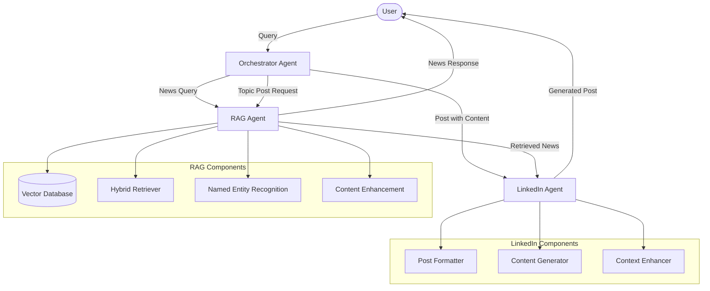

# News Article RAG System with LinkedIn Post Generation

## Overview
This system combines Retrieval-Augmented Generation (RAG) technology with content generation to deliver a powerful tool for news retrieval and LinkedIn content creation. The architecture follows an agent-based design pattern where specialized components handle different aspects of the workflow.

## System Architecture Flow



## Installation

```bash
# Clone the repository
git clone https://github.com/parth0774/News-Article-RAG-Agent.git

# Create virtual environment
python -m venv venv

# Activate virtual environment
venv\Scripts\activate

# Install dependencies
pip install -r requirements.txt

# Set up environment variables (create .env file)
echo "OPENAI_API_KEY=your_openai_api_key" > .env
echo "EMBEDDING_MODEL=your_model" > .env
echo "LANGSMITH_API_KEY=your_api_key" > .env
echo "LANGSMITH_ENDPOINT=your_endpoint_url" > .env

# Run the application
python app.py
```

## Project Structure
```
News-Article-RAG-Agent/
├── Agents/                      # Core agent implementations
│   ├── Agent1_Orchestrator.py   # Main orchestrator agent
│   ├── RAG_Agent2.py           # RAG implementation agent
│   └── LinkedIn_Agent3.py      # LinkedIn post generation agent
├── Create_Vectorstore/          # Vector database creation and management
│   ├── Create_Vectorstore.py   # Script to create vector store
│   ├── Inspect_Vectorstore.py  # Vector store inspection utilities
│   ├── chroma_db/              # Vector database storage
│   ├── inspection_results/     # Inspection output directory
│   └── News_Category_Dataset_v3.json  # Source news dataset
├── static/                      # Static web assets
├── templates/                   # Web application templates
├── Test/                        # Test files and utilities
├── app.py                       # Main application entry point
├── requirements.txt             # Project dependencies
└── README.md                    # Project documentation
```

## Key Features
- **Intelligent Query Routing**: Automatically determines whether user queries require news retrieval, LinkedIn post generation, or both
- **Hybrid Retrieval System**: Combines semantic and keyword-based search for improved accuracy
- **Named Entity Recognition**: Identifies key entities in queries and articles
- **Dynamic Content Enhancement**: Fetches additional content from article links when available
- **Professional LinkedIn Post Generation**: Creates engaging posts formatted for LinkedIn

## System Architecture
The system consists of three main agents:

### 1. Orchestrator Agent (Agent1_Orchestrator.py)
- Serves as the entry point for all user queries
- Uses LLM-based router to determine appropriate actions
- Coordinates information flow between specialized agents
- Routes queries based on content type and user needs

### 2. RAG Agent (RAG_Agent2.py)
- Finds and processes relevant news articles
- Implements vector database for semantic search
- Combines vector-based and keyword-based (BM25) search 
- Enhances content by fetching additional information from sources
- Provides comprehensive answers with source attribution

### 3. LinkedIn Agent (LinkedIn_Agent3.py)
- Generates professional posts optimized for LinkedIn
- Follows platform-specific formatting guidelines
- Incorporates news information when relevant
- Creates engaging hooks, hashtags, and calls-to-action

## Workflow Patterns

### Workflow 1: News Query
1. User asks for specific news
2. Orchestrator routes to RAG Agent
3. RAG Agent retrieves articles and generates response

### Workflow 2: LinkedIn Post with Provided Content
1. User provides content for LinkedIn post
2. Orchestrator routes directly to LinkedIn Agent
3. LinkedIn Agent generates professional post

### Workflow 3: LinkedIn Post about a Topic
1. User requests post about specific topic
2. Orchestrator routes to RAG Agent first
3. Retrieved information passes to LinkedIn Agent
4. LinkedIn Agent generates topic-informed post

## Technical Implementation
- **Vector Store**: Chroma database with embeddings for semantic search
- **Entity Extraction**: spaCy for named entity recognition
- **Content Retrieval**: Ensemble approach combining vector and keyword search
- **Data Sources**: Kaggle News Category Dataset plus dynamic URL content fetching
- **Error Handling**: Comprehensive logging and graceful fallbacks

## Data Ingestion Process
The system processes the Kaggle News Category Dataset through:
1. Loading JSON news data
2. Processing articles to extract relevant information
3. Creating document objects with appropriate metadata
4. Generating embeddings with a Hugging Face model
5. Storing documents and embeddings in a Chroma vector database

## Configuration
Environment variables control system behavior:
- `LLM_MODEL`: Language model selection
- `LLM_TEMPERATURE`: Temperature setting for generation
- `EMBEDDING_MODEL`: Model for vector embeddings
- `VECTOR_STORE_DIR`: Storage location for vector database

## Technologies Used
- LangChain: Framework for building language model applications
- Hugging Face: Provides embedding models for vector storage
- OpenAI: Language models for content generation
- Chroma: Vector database for storing article embeddings
- spaCy: Named Entity Recognition for entity extraction
- BM25: Keyword-based retrieval algorithm
- Newspaper3k: Library for fetching article content from URLs

## Future Enhancements
1. User feedback incorporation for improved response quality
2. Multi-platform social media support beyond LinkedIn
3. Sentiment analysis for tone customization
4. Automated knowledge base updates for current news
5. User preference personalization based on interaction history